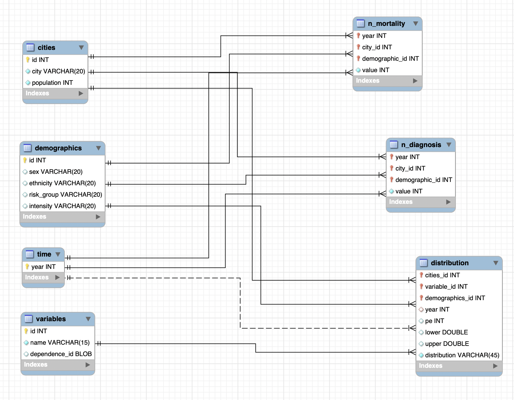

# Database Setup

Forward engineering code `forward_engineering.sql`is generated from the EER diagram below, using MySQLWorkbench

Data are stored in `data/Evidence-Inputs-Master.xlsx`

A simple example of the result database is coded in `create_sample_db.sql`

